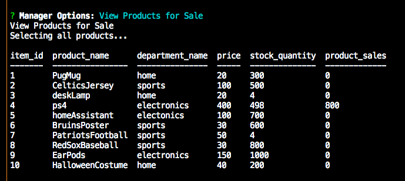
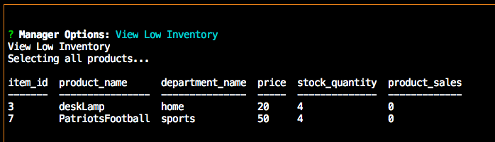
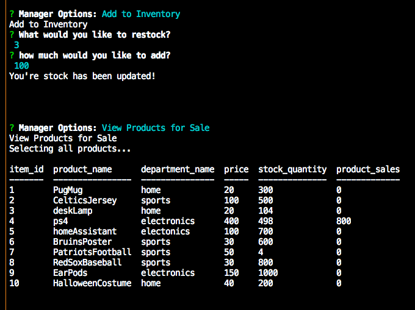
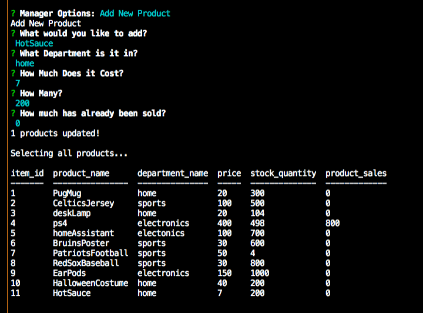
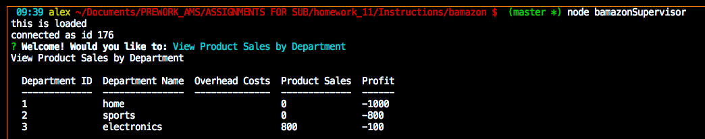

# Bamazon Market: Node.js & MySQL
<br>

## Description

Bamazon, the Amazon-like storefront which takes in orders from customers and deplete stock from the store's inventory. This application tracks product sales across your Bamazon's departments and then provide a summary of the highest-grossing departments in the store.


<br>

## Overview of App Organization

This is a command line interface program:

  * There are interfaces for the Customer, Manager and Supervisor.


The command:
```bash
 node bamazonCustomer:
 ```

   * Provides the list of available inventory

     * Inventory is stored in initial.csv

       * This keeps a record of the table before updates are made
       
     * schema.sql contains the initializations of the database and the table, it is recommended that the initial.csv be imported in mySQL table data import wizard

   * Allows the user the ability to order any amount of a product they identify by the item_id:

     * If the user orders more than available the user is informed and given the option to exit the program or place a different order

<br>

The command:
```bash
 node bamazonManager:
 ```
  * Will display the following menu options with self described tasks:

    * View Products for Sale

        * If a manager selects `View Products for Sale`, the app should list every available item: the item IDs, names, prices, and quantities.
    
    * View Low Inventory

      * If a manager selects `View Low Inventory`, then it should list all items with an inventory count lower than five.
    
    * Add to Inventory

      * If a manager selects `Add to Inventory`, your app should display a prompt that will let the manager "add more" of any item currently in the store.
    
    * Add New Product

      * If a manager selects `Add New Product`, it should allow the manager to add a completely new product to the store.

    <br>

The command:
```bash
 node bamazonSupervisor:
 ```
   * View Product Sales by Department
     * Provides a summarized table in their terminal/bash window similar to the one below which has all changes previously made by the bamazonCustomer command.

| department_id | department_name | over_head_costs | product_sales | total_profit |
| ------------- | --------------- | --------------- | ------------- | ------------ |
| 01            | Electronics     | 10000           | 20000         | 10000        |
| 02            | Clothing        | 60000           | 100000        | 40000        |

   * Create New Department

     * Allows the Supervisor to add a new department from the terminal

   <br>


## Run Instructions

### As a Customer: 

The application begins with the Bamazon inventory and the option to place an order:


   * When the user selects __Order__ :

     * The user is asked what item they would like to order

     * How much of the product they are interested in
     
     

  * If the order exceeds the inventory the following message is shown

  

  * The user can then place a new order or leave the application

<br>

### As a Manger:

  * If a manager selects `View Products for Sale`:
   

  * If a manager selects `View Low Inventory`:
   

  * If a manager selects `Add to Inventory`:
   

  * If a manager selects `Add New Product`: 
   
<br>

### As a Supervisor: 

* When a supervisor selects `View Product Sales by Department`
   
  * The `total_profit` column should be calculated on the fly using the difference between `over_head_costs` and `product_sales`. Notice the last sale

<br>

## This App Utilizes

   * [Node.js](https://nodejs.org/en/about/)

   * [mySQL](https://www.mysql.com/)

   * [Inquirer](https://www.npmjs.com/package/inquirer)


<br>


## Role in Development

My name is Alex I am a bootcamp student whose portfolio can be found
[here.]( https://alexsamalot19.github.io/Samalot-Alexander-Portfolio/)

A table of relevant projects and where they can be found in the README of the [GitHub Repo](https://github.com/alexSamalot19/Samalot-Alexander-Portfolio)


I designed this app using existing APIs and packages listed in the **This App Utilizes** section. I utilized Node.js and mySQL to take in orders from customers and deplete stock from the store's inventory.