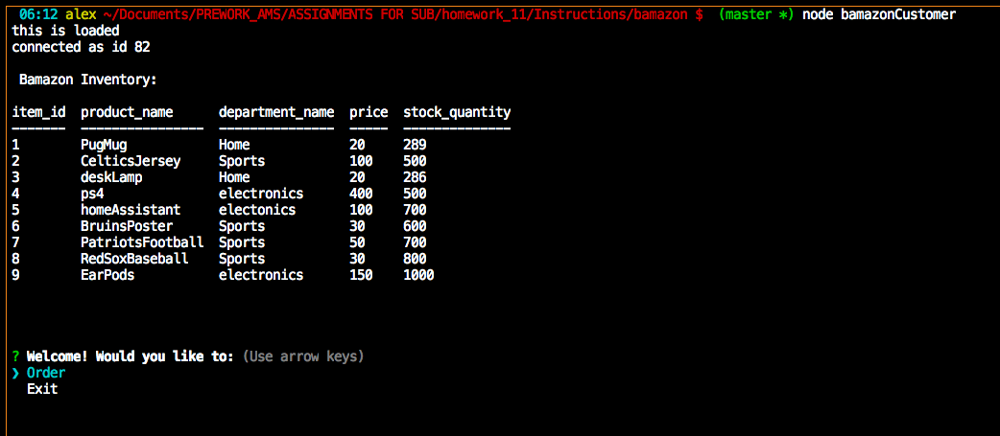

# Bamazon Market: Node.js & MySQL
 

## Problem

Bamazon, the Amazon-like storefront which takes in orders from customers and deplete stock from the store's inventory.

 

## Overview of App Organization

This is a command line interface program

The file bamazonCustomer.js:

   * Provides the list of available inventory

   * Allows the user the ability to order any amount of a product they identify by the item_id:

     * If the user orders more than available the user is informed and given the option to exit the program or place a different order

 

## Run Instructions

The application begins with the Bamazon inventory and the option to place an order:

   * When the user selects --Order--:

     * The user is asked what item they would like to order

     * How much of the product they are interested in
     
     

          *If the order exceeds the inventory the following message is shown

     

    * The user can then place a new order or leave the application

 

## This App Utilizes

   * [Node.js](https://nodejs.org/en/about/)

   * [mySQL](https://www.mysql.com/)

   * [Inquirer](https://www.npmjs.com/package/inquirer)

 

## Role in Development

My name is Alex I am a bootcamp student whose portfolio can be found
[here.]( https://alexsamalot19.github.io/Samalot-Alexander-Portfolio/)

I designed this app using existing APIs and packages listed in the **This App Utilizes** section. I utilized Node.js and mySQL to take in orders from customers and deplete stock from the store's inventory.